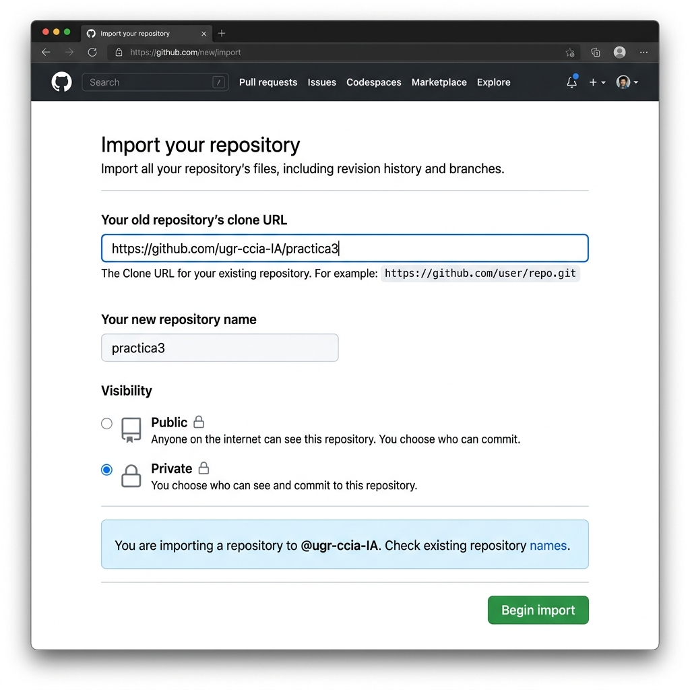

# Práctica 3 de *Inteligencia Artificial*, curso 2025/2026

## Prerrequisitos

### Crear una cuenta en [GitHub](https://github.com/). 
Para ello, puedes usar tu correo personal, el de *@correo.ugr.es* o el de *@go.ugr.es*.


### 1. Añadir tu clave SSH a GitHub
Hay varias maneras de conectarte desde tu ordenador a GitHub. Si utilizas un navegador, usarás tu usuario y contraseña. Desde el terminal, lo más cómodo es utilizar una clave SSH. Puedes crear una nueva si no tienes, o reutilizar una ya existente. Tienes toda la información para realizar la configuración en: 
[Conectar a GitHub con SSH](https://docs.github.com/es/authentication/connecting-to-github-with-ssh)


### 2. Crear tu copia personal del repositorio de la asignatura
Cada estudiante debe tener su propia copia del repositorio para poder trabajar sobre ella de forma privada. En adelante, a tu copia la llamaremos *origin*, y al repositorio original de la asignatura lo llamaremos *upstream*.

Para garantizar que tu trabajo no sea público, utilizaremos el proceso de **importación de repositorio** de GitHub.

Para realizar la copia, una vez que tengas creada tu cuenta en GitHub, haz click en <https://github.com/new/import> y rellena tal y como se ve en la imagen de abajo. El repositorio que quieres importar es `https://github.com/ugr-ccia-IA/practica3`. ¡Asegúrate de que tu repositorio es privado!




### 3. Clonar tu repositorio en tu máquina
Una vez hecho el paso anterior, tendrás tu repositorio personal de la práctica3 en GitHub; puedes descargarlo a tu ordenador usando:
`git clone git@github.com:TU_USUARIO_GITHUB/practica3.git` (si no has configurado tu clave SSH, esto no funcionará).


### 4. Modificar el código y guardar los cambios
Es el momento de empezar a modificar ficheros. Abre el fichero README.md (este fichero), ve al final y añade una línea que diga "Esto lo puse yo."
Una vez lo hayas modificado, guarda el fichero, y ejecuta los siguientes comandos en el terminal estando dentro de la carpeta `practica3`:

```
git add . 
git commit -m "Modificando README.md"
git push origin main 
```

Los tres comandos anteriores le indican a git que 1) queremos guardar una nueva versión con todos los ficheros modificados de la carpeta, 2) que haga esa versión y le ponga el comentario "Cambiando el enlace del botón", y 3) que envíe esta nueva versión a la copia de nuestro repositorio alojada en GitHub.

Este proceso es el que debes repetir cada vez que vayas avanzando en la implementación de la práctica: add, commit, push.


### 5. Enlazar tu repositorio personal con el de la asignatura
Aunque tu repositorio y el de la asignatura (recuerda que los conocemos por *origin* y *upstream* respectivamente) sean independientes, nos va a interesar que estén enlazados. De esta forma, podrás aplicar fácilmente sobre tu repositorio (*origin*) cualquier actualización que los profesores realicemos en *upstream*. Para enlazarlos, ejecuta lo siguiente dentro de la carpeta de tu repositorio:

`git remote add upstream git@github.com:ugr-ccia-IA/practica3.git`


### Actualizar tu repositorio con cambios realizados en el de la asignatura
Una vez tengas los repositiorios enlazados, lo único que debes hacer para aplicar posibles cambios en el repositorio de la asignatura en tu repositorio (cambios de *upstream* en *origin*) es: `git pull upstream main`

Hacer esto no sobreescribirá tus avances en la implementación de la práctica, puesto que tú no deberías haber modificado ninguna parte del código diferente a la que se indica en el guión.

Si quieres que esos cambios también se guarden en github, a continuación ejecuta: `git push origin main`


> Si quieres saber más sobre Git y GitHub, en Internet existen multitud de recursos, incluidos videos y tutoriales. Para realizar esta práctica sólo necesitas lo básico (hacer commits), pero hay muchas cosas más que se pueden hacer con estas herramientas (uso de ramas, gestión de conflictos, etc.) 
El propio GitHub pone a tu disposición un [breve curso](https://classroom.github.com/a/W33pQ3pa) (en inglés) para aprender lo básico.


## Realización de la práctica
El guión (disponible en [PRADO](https://pradogrado2526.ugr.es/)) contiene toda la información sobre en qué consiste la práctica3. Leelo con atención.

Junto a ellos, también tienes a tu disposición una pequeña presentación de resumen, y un tutorial. Debes revisarlos pues continen los primeros pasos a realizar.


### Instalación local (Linux)

Una vez clonado tu repositorio personal en tu ordenador, puedes preparar y compilar el código ejecutando el script de instalación:

```bash
./install.sh
```

Este script instalará las dependencias necesarias y realizará la primera compilación. Si realizas cambios en el código posteriormente, solo necesitas ejecutar:

```bash
make -j$(nproc)
```

> [!NOTE]
> Por defecto, el software se compila en modo **Release** para garantizar el máximo rendimiento de la IA. Si necesitas depurar errores complejos y quieres compilar en modo **Debug**, ejecuta:
> `cmake . -DCMAKE_BUILD_TYPE=Debug && make clean && make -j$(nproc)`

A continuación, puedes lanzar el software con hebras con `./n_en_raya`, o sin hebras con `./n_en_rayaSH`. Para una partida rápida que juega un humano contra otro, usa `./n_en_raya -p1 humano -p2 humano`.


## Más información
Hemos creado un [fichero con preguntas frecuentes](./FAQ.md) que han ido apareciendo en las distintas sesiones de prácticas.

